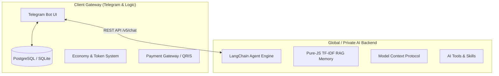

<div align="center">
  
  <h1>Elynisia Enterprise AI Platform</h1>
  <p><strong>Decentralized, Microservices-Based Autonomous AI Agent Ecosystem</strong></p>

  [](https://nodejs.org)
  [](LICENSE)
  []()
  []()
  
  <p>
    <a href="#-overview">Overview</a> •
    <a href="#-architecture">Architecture</a> •
    <a href="#-key-features">Key Features</a> •
    <a href="#-installation--setup">Installation</a> •
    <a href="#-private-server-saas">Private Server (SaaS)</a> •
    <a href="#-observability">Observability</a>
  </p>
</div>

---

## 📖 Overview

**Elynisia** is a high-performance, enterprise-grade AI platform disguised as a Telegram Bot. Under the hood, it operates on a highly decoupled **Client-Server Microservices Architecture**. 

It allows administrators to run the core AI intelligence (Server) and the user interface (Telegram Client) on entirely separate environments. Furthermore, Elynisia supports a **Private Server (SaaS)** model, allowing your end-users to host their own "AI Brain" on their local hardware while still using your centralized Telegram Bot Gateway for interactions.

## 🏗️ Architecture

Elynisia's codebase is strictly divided into two primary domains to ensure security, scalability, and ease of maintenance:



1. **`/client/`**: Handles all user interactions, database mutations, economy states, and payments. The client is completely unaware of the AI logic; it only routes messages.
2. **`/server/`**: The heavy-lifting AI engine. Contains LangChain implementations, Vector embeddings, Tool calling, and Long-Term Memory (RAG).

## ✨ Key Features

### 🧠 Pure-JS Offline RAG (Retrieval-Augmented Generation)
No expensive Pinecone or external Vector Databases required. Elynisia implements a proprietary **TF-IDF Cosine Similarity Algorithm** written in pure JavaScript. It indexes user chat history and extracts exact semantic memories in milliseconds without relying on external APIs.

### 🌐 Multi-Server Routing (SaaS Model)
Elynisia acts as a massive router. Users can register their own local PCs as a "Private Server" node.
- `/server connect http://<ip>:3005 <password> MyNode`
- The Global Bot will instantly bypass the Global AI and forward all chat payloads (via HTTP POST) to the user's local machine.

### 🛡️ Owner-Level Workspace Control
The bot features a fully sandboxed Interactive Terminal (`$ <command>`). Standard users are blocked from executing destructive commands (`rm -rf`) or viewing system directories (`/etc`). However, the registered `OWNER_ID` possesses **Root-Level Bypass**, granting total server administration directly from the Telegram chat.

### 📊 Enterprise Observability
Built-in `prom-client` exposes real-time metrics at `/metrics` (Port 3000). Easily attach **Prometheus** and **Grafana** to monitor:
- Active Users & TPS (Transactions Per Second)
- AI Token Usage (Input/Output)
- E-Commerce Gross Revenue

## 🚀 Installation & Setup

### System Requirements
- Node.js v18.0.0 or higher
- 2GB RAM minimum (4GB recommended for Global AI processing)
- Linux (Ubuntu/Debian), Windows, or Termux (Android ARM64)

### 📦 Installation & Setup

1. **Install via One-Liner (Mac/Linux/Termux)**
   ```bash
   curl -sL https://raw.githubusercontent.com/arthurlucky/Elynisia-Bot-telegram-/main/install.sh | bash
   ```

2. **Global CLI (Optional but Recommended)**
   Setelah install, tautkan CLI ke sistem secara global:
   ```bash
   cd Elynisia
   npm link
   ```
   Sekarang kamu bisa menggunakan perintah `elynisia` di mana saja!

3. **Start the Setup Wizard**
   Jalankan Setup Wizard interaktif:
   ```bash
   elynisia setup
   # Atau jika tidak di-link: npm start
   ```

### ⌨️ CLI Commands Reference
- `elynisia setup` : Menjalankan wizard inisialisasi AI, Port, dan Token Telegram.
- `elynisia reset` : **[DANGER]** Menghapus seluruh file konfigurasi (`.env`) dan Database SQLite (`memory/`).
- `elynisia status` : Melihat metrik *runtime*, memori, jumlah file, dan PID aktif.
- `elynisia userlist` : Melihat seluruh pengguna yang menggunakan bot.
- `elynisia rolemanager <uid> <role>` : Mengganti pangkat pengguna secara manual.

The console will prompt you to select the runtime mode:
```text
=========================================
🚀 ELYNISIA GLOBAL WIZARD (CLIENT & SERVER)
=========================================
1. Global Mode -> Jalankan Keduanya (Client Telegram + Server AI)
2. Server Only -> Menjalankan AI Backend (Port 3000)
3. Client Only -> Menjalankan Bot Telegram (Proxy Mode)
```
- *Your choice is automatically saved to `.env` for future autonomous reboots.*

## 💼 Private Server SaaS (Monetization)

As the CEO of the platform, you can distribute a highly-compressed, white-labeled version of your AI Engine for users who wish to host their own Private Nodes.

Run the auto-compiler script:
```bash
node build_private_server.js
```
This script dynamically packages the `server/` directory into a lightweight `dist/server.zip` (ignoring `.env` and `node_modules`). 

**User Experience:**
1. User types `/server guide` in your Telegram Bot.
2. The bot instantly sends them the `server.zip` file.
3. User extracts it on their PC, runs `npm start`, and follows the Interactive Wizard to input their personal Gemini API Key.
4. User links their PC to your bot using the `/server connect` command.

## 🔐 Security & Data Privacy
- **Stateless AI Processing**: Private servers do not hold Global Database credentials. The Telegram Client (`/client`) retains absolute authority over User IDs, Economy Balances, and Roles.
- **Cross-Platform Compatibility**: Carriage return parsing (`\r\n`) has been normalized, guaranteeing that generated config files work flawlessly across Windows and POSIX systems.

---
<div align="center">
  <i>Developed with ❤️ by the Elynisia Elite Engineering Team</i>
</div>
